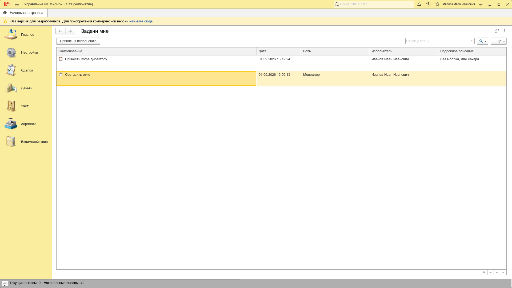
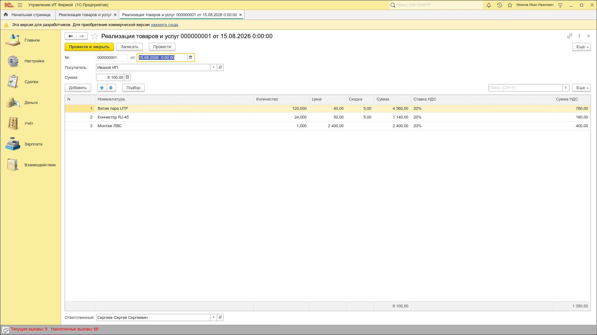
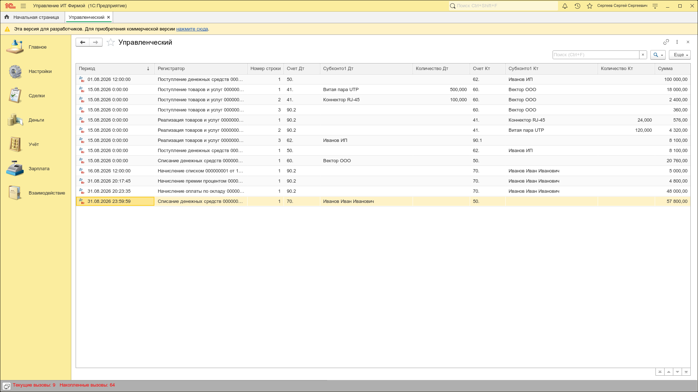
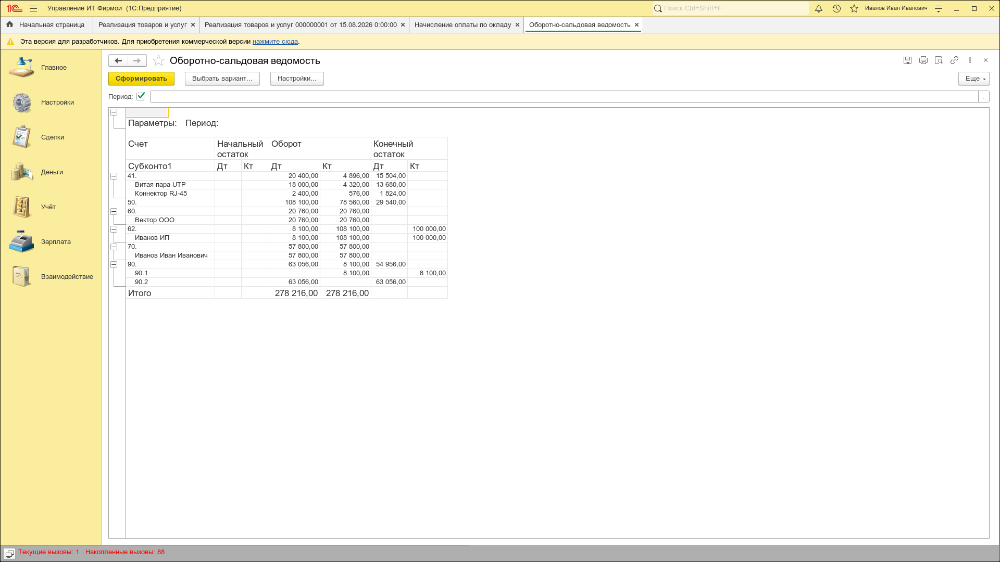
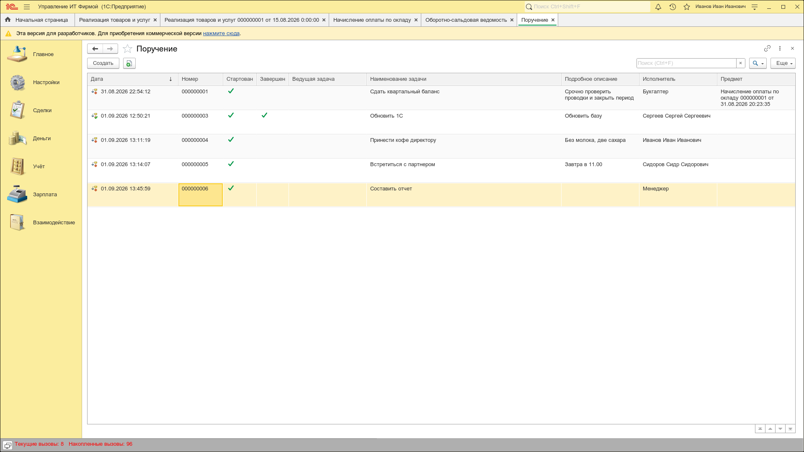
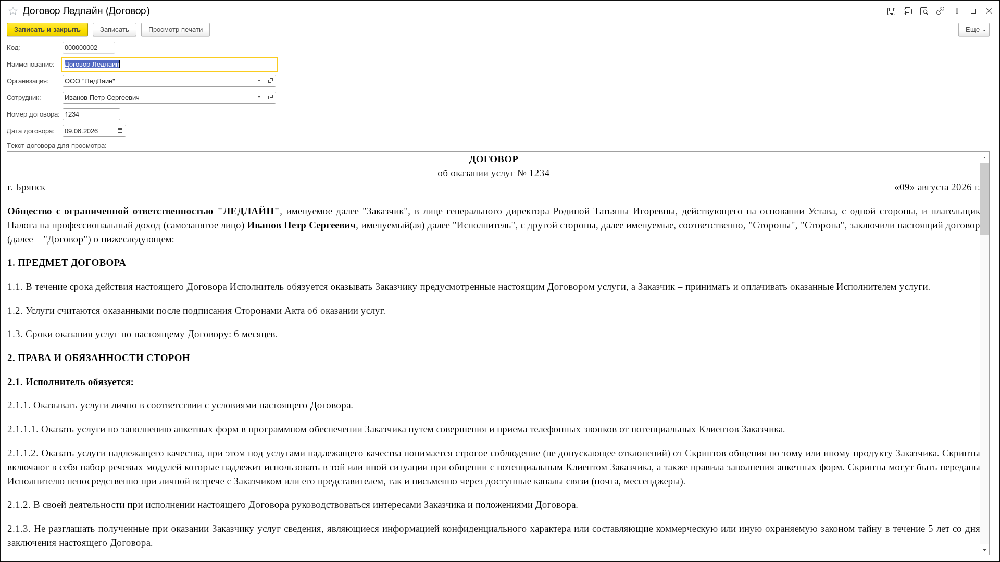
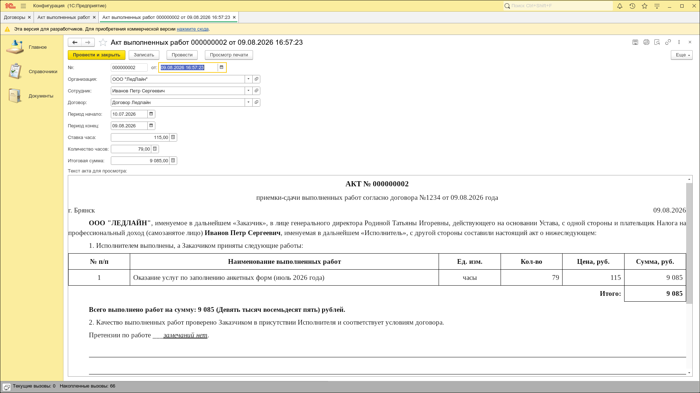

# Моё портфолио разработчика 1С:Предприятие

## Обо мне


Программист 1С (платформа 8.3) в поиске позиции разработчика и доработчика конфигураций 1С:Предприятие 8.3. Проектирую метаданные, пишу бизнес-логику проведения и запросы, настраиваю отчётность на СКД, делаю печатные формы. Дорабатываю конфигурации через механизм расширений (без снятия с поддержки), ориентируюсь в БСП.

С нуля разработал две конфигурации 1С 8.3 — учётную систему ИТ-фирмы (торговля, деньги, зарплата, бизнес-процессы, отчётность на СКД) и документооборот с автоматическим формированием актов из HTML-шаблона (сумма прописью до миллиардов, склонение ФИО). Пишу понятный, поддерживаемый код. Осознанно перешёл в ИТ: зрелый профессиональный бэкграунд — общение с заказчиками, понимание бизнес-логики задач, доведение проектов до финала.


<br clear="both">

GitHub: [svistoplysoff/1c-portfolio](https://github.com/svistoplysoff/1c-portfolio)

Разработка на платформе **1С:Предприятие 8.3.27** (управляемое приложение, интерфейс «Такси», русский вариант языка).

Репозиторий содержит два самостоятельных учебных проекта, которые демонстрируют навыки разработки и настройки конфигураций: от структуры метаданных и бизнес-логики проведения до отчётности и печатных форм.

---

## Проект 1. «Управление ИТ фирмой»

Учётная система ИТ-компании: закупки и продажи, деньги, расчёты с контрагентами, цены и скидки, зарплата, бизнес-процессы с задачами, управленческий учёт и отчётность.

### Что реализовано

**Торговля и учёт товаров**
- Документы «Поступление товаров и услуг» и «Реализация товаров и услуг» с табличными частями, автозаполнением цен из регистра и ответственного из параметра сеанса.
- Проведение реализации с **контролем отрицательных остатков** одновременно в регистре накопления (оперативный учёт) и регистре бухгалтерии (бухгалтерский учёт); при нехватке товара — отказ в проведении с понятным сообщением пользователю.
- **Расчёт себестоимости** списания средневзвешенным методом (пропорционально остаткам) по обоим контурам учёта.
- Регистры накопления: «Товары», «Доходы», «Расходы», «Взаиморасчёты с контрагентами».

**Деньги**
- Документы «Поступление» и «Списание денежных средств», контроль взаиморасчётов с контрагентами.

**Цены и скидки**
- Документы «Установка цен» и «Установка скидок», регистры сведений «Цены» и «Скидки», журнал «Цены и скидки».
- Общие модули: серверный и клиентский (вызовы сервера) для получения цены/скидки на дату, клиент-серверный расчёт с НДС, проверка корректности ИНН.

**Зарплата**
- Механизм расчёта: план видов расчёта «Начисления» (оклад, премия процентом, фиксированная премия, больничный, отпуск), регистр расчёта «Зарплата» с периодами действия, документы «Начисление списком», «Начисление оплаты по окладу», «Начисление премии процентом».
- Функциональная опция «Вести расчёт зарплаты» и форма настройки программы.

**Бизнес-процессы и задачи**
- Бизнес-процесс «Поручение» с маршрутом, формирование задач с исполнителем (сотрудник или роль), задачи «Задачи мне» на рабочем столе.

**Управленческий учёт и отчётность**
- План счетов «Управленческий» с видами субконто, регистр бухгалтерии «Управленческий», документы формируют проводки (двойная запись).
- Отчёты: «Оборотно-сальдовая ведомость», «Взаиморасчёты с контрагентами», «Движение товаров», «Доходы и расходы» (СКД).
- Обработка «Заполнение календаря» — генерация производственного календаря в регистр сведений.

**Общая архитектура**
- Подсистемы: «Настройки», «Сделки», «Деньги», «Учёт», «Зарплата», «Взаимодействие».
- Параметр сеанса «Текущий сотрудник», определяемые типы (`Сумма`, `Количество`, `ПредметПроцесса`), роли «Полные права» и «Базовые права», общий интерфейс «Такси» с домашней страницей.

### Состав метаданных

| Тип | Объекты |
|---|---|
| Справочники | Контрагенты, Сотрудники, Номенклатура, Номенклатурные группы, Роли |
| Документы | Поступление/Реализация товаров и услуг, Поступление/Списание денежных средств, Установка цен/скидок, Начисление списком, Начисление оплаты по окладу, Начисление премии процентом |
| Регистры | Накопления (4), сведений (4), бухгалтерии (1), расчёта (1) |
| Планы | Счетов (1), видов расчёта (1), видов характеристик (1) |
| Отчёты | ОСВ, Взаиморасчёты, Движение товаров, Доходы и расходы |
| Бизнес-процессы/задачи | Поручение, Задача |

### Скриншоты

| Рабочий стол «Такси» | Реализация товаров и услуг |
|---|---|
| [](Скриншоты/stol.png) | [](Скриншоты/realizaciya.png) |

| Движения и проводки реализации | Оборотно-сальдовая ведомость | Бизнес-процесс «Поручение» |
|---|---|---|
| [](Скриншоты/dvizheniya.png) | [](Скриншоты/osv.png) | [](Скриншоты/poruchenie.png) |

---

## Проект 2. «Автоматизация документооборота»

Компактная конфигурация учёта договоров и актов выполненных работ ИТ-специалиста.

### Что реализовано
- Справочники «Сотрудники», «Договоры», «Организации» (с руководителем организации), подсистемы «Справочники» и «Документы».
- Документ «Акт выполненных работ»: часы × ставка, автопересчёт итоговой суммы на форме, формирование акта из **HTML-шаблона**.
- Серверная генерация печатной формы: подстановка данных в макет, склонение ФИО по падежам с определением рода, **сумма прописью** (до миллиардов), период прописью; вывод в окно предпросмотра.
- Клиент-серверное взаимодействие: функции `НаСервереБезКонтекста` для чтения связанных данных, запись/чтение временного файла UTF-8 на сервере с его удалением, `НаКлиенте` обработчики.

### Состав метаданных
| Тип | Объекты |
|---|---|
| Справочники | Сотрудники, Договоры, Организации |
| Документы | Акт выполненных работ |
| Шаблоны | Шаблон акта (HTML), Шаблон договора (HTML) |

### Скриншоты

| Договор (форма элемента) | Печатная форма акта |
|---|---|
| [](Скриншоты/dogovor.png) | [](Скриншоты/pechat_akta.png) |

---

## Технологический стек

- **Платформа:** 1С:Предприятие 8.3.27.
- **Режим:** управляемое приложение, интерфейс «Такси», русский вариант языка.
- **Язык программирования:** встроенный язык 1С (русский), включая **язык запросов**: временные таблицы (`ПОМЕСТИТЬ`), соединения, виртуальные таблицы остатков регистров, группировки.
- **Отчётность:** система компоновки данных (СКД).
- **Печать:** HTML-шаблоны с подстановкой значений, сумма прописью, склонение ФИО.
- **Метаданные:** справочники, документы, регистры всех типов, планы счетов/видов расчёта/видов характеристик, бизнес-процессы и задачи, отчёты, обработки, общие модули, роли, подсистемы, функциональные опции, параметры сеанса, определяемые типы.

---

## Как открыть проекты

Выгрузки выполнены в иерархический XML (ConfigDumpInfo, формат 2.20). Загрузка в базу:

1. Установить платформу 1С:Предприятие **8.3.27**.
2. Создать пустую информационную базу.
3. В Конфигураторе: **Конфигурация → Загрузить конфигурацию из файлов…** → выбрать папку нужного проекта.
4. Обновить конфигурацию базы данных (**F7**).

---

## Структура репозитория

```
Портфолио/
├── Скриншоты/                      # скриншоты для README
├── Мое фото/                      # фото для блока «Обо мне»
├── Управление ИТ фирмой/          # проект 1
│   ├── Configuration.xml          # состав конфигурации
│   ├── ConfigDumpInfo.xml         # UUID объектов
│   ├── Catalogs/ Documents/ Reports/ Registers/ ...  # объекты метаданных
│   └── Ext/                       # модуль сеанса, командный интерфейс
└── Автоматизация документооборота/  # проект 2
    ├── Configuration.xml
    └── Catalogs/ Documents/ Subsystems/
```

---
**Контакты:** [Брянск] · [maxim.rodin32@mail.ru] · [Telegram] · [+7(980)316-20-15]

